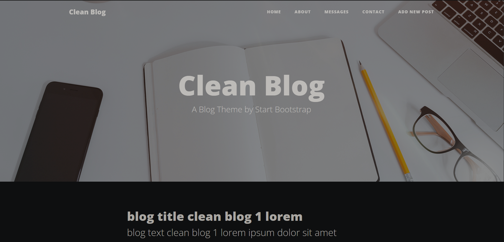

# Clean Blog

## Site Details

This site is a site created for practical purposes and is open to development. the features of the site are as follows

- Home
    - The blogs you have created will be listed here
- About
Contact
    - The messages to be added to the messages page are created here
- Messages
    - The messages created on the contact page are listed here
- Add New Post
    - Created posts are also listed at home

## Installition

##### The package in your package.json the following command to load the dependencies in the json file.

npm install

#### With the npm run command, you can run the commands specified in the scripts section. Example Script;

npm start

## Site Link
[Go Site](https://clean-blog-2-20ca20cc9453.herokuapp.com)

## Contact
[Send Mail](mailto:ffurkanerdal@gmail.com)